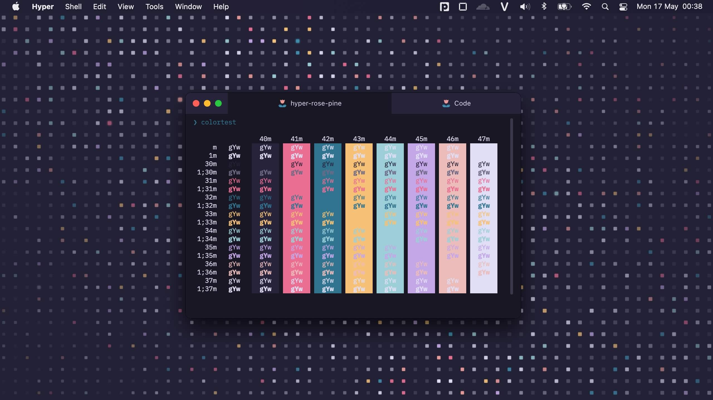

<p align="center">
    
    <h2 align="center">Rosé Pine for Hyper</h2>
</p>

<p align="center">All natural pine, faux fur and a bit of soho vibes for the classy minimalist</p>

<p align="center">
    <a href="https://github.com/rose-pine/rose-pine-theme">
        
    </a>
</p>


_Check out `wallpaper` folder for static & dynamic variants_

## Usage

```sh
$ hyper i hyper-rose-pine-next
```

or

```js
// ~/.hyper.js
module.exports = {
  plugins: ["hyper-rose-pine-next"],
}
```

## Configuration

There are 3 variants in this theme. You can these values in the config files:

- dark (Dark)
- moon (Dark, but dimmed)
- dawn (Light)

```js
// ~/.hyper.js
module.exports = {
  config: {
    hyperRosePine: {
      // Dynamic theme settings
      appearance: {
        // Default is "dark"
        dark: "moon",
        light: "dawn",
      },
      // Hide the window controls (traffic buttons) on Mac. Default is false
      hideControls: true,
      // Hide in-app notification after 20 seconds. Default is false
      // I add this because there is no way to dismiss new version notification in the past
      hideNotifications: true,
      // Hide tab title when there is only 1 tab opening. Default is true
      hideTabTitle: true,
      // Hide SVG Rose icons for all tabs. Default is false
      hideTabIcons: false,
    },
  },
}
```

Restart Hyper app to apply changes.

## Gallery

<details>
  <summary>Dark</summary>
  <p>
    
  </p>
  <p>
    
  </p>
</details>

<details>
  <summary>Moon</summary>
  <p>
    
  </p>
  <p>
    
  </p>
</details>

<details>
  <summary>Dawn</summary>
  <p>
    
  </p>
  <p>
    
  </p>
</details>

## Recommended config

### Typography (Hyper)

It’s recommended to use [Nerd Font](https://www.nerdfonts.com) to add a high number of extra glyphs (icon).

```js
// font family with optional fallbacks
fontFamily: "JetBrainsMono Nerd Font",

// default font weight: 'normal' or 'bold'
fontWeight: "normal",

// font weight for bold characters: 'normal' or 'bold'
fontWeightBold: "normal",

// line height as a relative unit
lineHeight: 1.2,

// letter spacing as a relative unit
letterSpacing: 0,
```

### Glyph (OhMyZSH)

```sh
ZSH_DISABLE_COMPFIX="true"

# https://spaceship-prompt.sh
ZSH_THEME="spaceship"

# Uncomment the following line to disable auto-setting terminal title.
DISABLE_AUTO_TITLE="true"
function set_win_title() {
        echo -ne "\033]0; $(basename "$PWD") \007"
}

precmd_functions+=(set_win_title)

# Automatically load a node version in the current working directory.
NVM_AUTOLOAD=1

# Disable the highlighting of pasted text
zle_highlight=('paste:none')

# Spaceship customization

# Prompt character to be shown before any command
SPACESHIP_CHAR_SYMBOL="  "
# Prefix before Git section
SPACESHIP_GIT_PREFIX="on branch  "
# Prefix before Git branch subsection
SPACESHIP_GIT_BRANCH_PREFIX=""
# Prefix before package version section
SPACESHIP_PACKAGE_PREFIX="version 爐"
# Character to be shown before package version
SPACESHIP_PACKAGE_SYMBOL=""
# Prefix before Node.js section
SPACESHIP_NODE_PREFIX="with  "
# Character to be shown before Node.js version
SPACESHIP_NODE_SYMBOL=""
# Show current active gcloud configuration or not
SPACESHIP_GCLOUD_SHOW="false"
# Show Kubernetes section
SPACESHIP_KUBECTL_SHOW="true"
# Prefix before Kubernetes section
SPACESHIP_KUBECTL_PREFIX="environment   "
# Character to be shown before Kubernetes subsection
SPACESHIP_KUBECTL_SYMBOL=""
# Show Kubernetes version subsection
SPACESHIP_KUBECTL_VERSION_SHOW="false"
# Suffix after Kubectl context section
SPACESHIP_KUBECONTEXT_SUFFIX=""
```
